# Exercices
## Exercise 1 (Repo 1): Discover the Code & Rough Size

###  Bank
```bash
    java -jar ckjm_ext.jar target/classes/bankAccountApp/Bank.class
```
- **LOC :** 413
- **NOM :** 14
- **Short description of responsibility :** Handle bank operations (create, update, delete accounts, etc...).

###  BankAccount
```bash
    java -jar ckjm_ext.jar target/classes/bankAccountApp/BankAccount.class
```
- **LOC :** 462
- **NOM :** 20
- **Short description of responsibility :** Handle account operations (get balance, set limit, withdraw money, etc...).

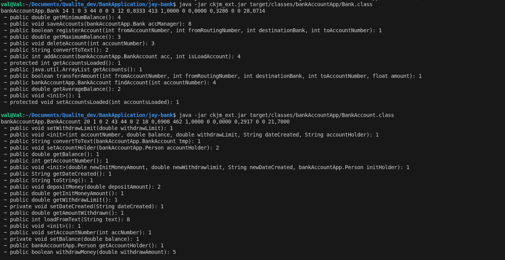

###  Person
```bash
    java -jar ckjm_ext.jar target/classes/bankAccountApp/Person.class
```
- **LOC :** 325
- **NOM :** 23
- **Short description of responsibility :** Handle client data (name, email, etc...)

###  BankAccountApp
```bash
    java -jar ckjm_ext.jar target/classes/bankAccountApp/BankAccountApp.class
```
- **LOC :** 491
- **NOM :** 2
- **Short description of responsibility :** App base.

BankAccountApp's size seems way too big for the number of methods it contains.
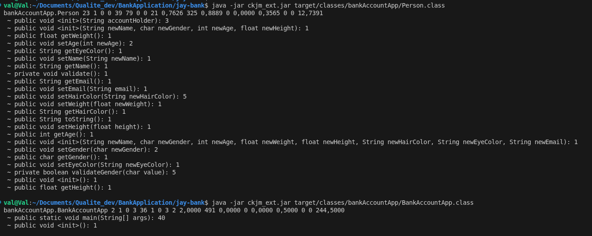


## Exercise 2 (Repo 1): Cyclomatic Complexity on a Key 

###  BankAccount
```bash
    java -jar ckjm_ext.jar target/classes/bankAccountApp/BankAccount.class
```
#### Weighted Methods per Class
20
#### Cyclomatic Complexity per method
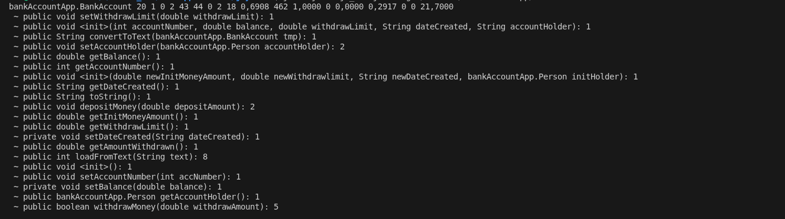
The total Cyclomatic Complexity of the file is 33.
#### Method choosen : withdrawMoney
##### Tasks
1) 
**Cyclomatic Complexity value :** 5
```java
	public boolean withdrawMoney(double withdrawAmount) { 
		if (withdrawAmount >= 0 && balance >= withdrawAmount && withdrawAmount < withdrawLimit
				&& withdrawAmount + amountWithdrawn <= withdrawLimit) {   // decision point 1 (if)
			balance = balance - withdrawAmount;
			success = true;
			amountWithdrawn += withdrawAmount;
		} else { // decision point 2 (else)
			success = false;
		}
		return success;
	}
```
2) 
To reduce complexity, I would starts by removing the **else** block. I would then removed  the **success** variable to simply return true or false.
Finally, I would create a helper function **checkAccountBalance** to simplify the **if**.

3) Bonus
```java
	public boolean withdrawMoney(double withdrawAmount) { 
		if (checkAccountBalance(withdrawAmount)) {   // decision point 1 (if)
			balance = balance - withdrawAmount;
			amountWithdrawn += withdrawAmount;
			return true;
		}
		return false;
	}

    public boolean checkAccountBalance(double withdrawAmount){
		/* 	Simplifying the if value as one of the clauses was redundant 
			(if withdrawAmount + amountWithdrawn <= withdrawLimit, 
			then withdrawAmount is < to withdrawLimit so there is no need to check).
		*/
        return (withdrawAmount >= 0 && balance >= withdrawAmount && withdrawAmount + amountWithdrawn <= withdrawLimit);
    }
```

The CC value of **withdrawMoney()** has lowered to 2. However the CC value of **checkAccountBalance()** is 4.

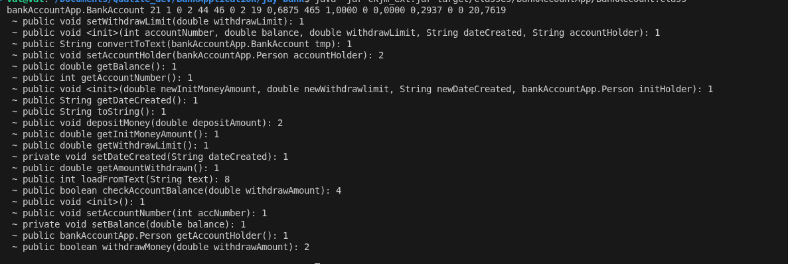


## Exercise 3 (Repo 1): CK Metrics Across Classes: Who Looks “Smelly”?
3) 
| Class       | LOC | WMC | CBO | LCOM |
| :---------- | :-: | :-: | :-: | :--: | 
| Bank        | 413 |  14 |  3  |   0  |
| BankAccount | 460 |  21 |  2  |  46  |
| Person      | 325 |  23 |  0  |  79  |

*Bank.class*
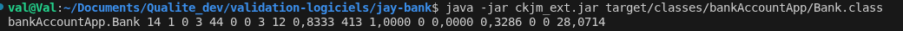
*BankAccount.class*
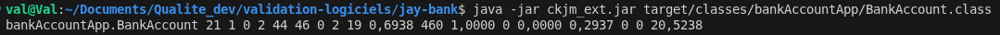
*Person.class*

4) 
- **Class with highest WMC :** Person ;
- **Class with the highest CBO :** Bank ;
- **Which one class would I worry about most for future maintenance, and why ?**

| Class       | WMC + CBO + LCOM |
| :---------- | :--------------: | 
| Bank        |        17        |
| BankAccount |        66        |
| Person      |       102        |

Based on this, I would worry the most about the **Person** class, as it has the highest maintainability indicator.

## Exercise 4 (Repo 1): SonarQube: Static Analysis & Quick Fixes
**Tasks**
- 3 issues I consider important :
  - "Try-with-resources should be used" (Bank.java:144) : It is important to handle this issue as it could cause memory leaks and impact performance.
  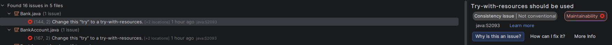
  - "String literals should not be duplicated" (BankAccountApp.java:96) : It is important because it makes the code way easier to maintain if there is a need to change the value of the string. 
  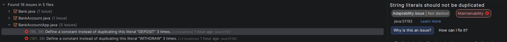
  - "Cognitive Complexity of methods should not be too high" (BankAccountApp.java:20) : It is important to have a readable and clear code.
  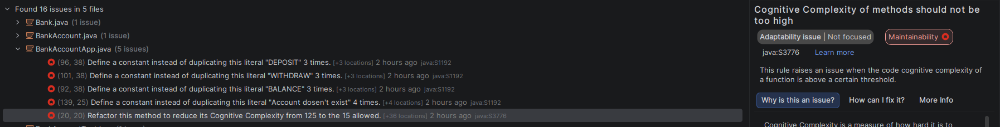

**Note :** These issues appear multiple times, so I only put the first one found as an example.

I fixed these 4 issues :
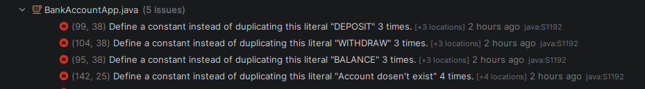
To do so, I replaced the literal strings by environment variables.
If I rerun SonarLint :
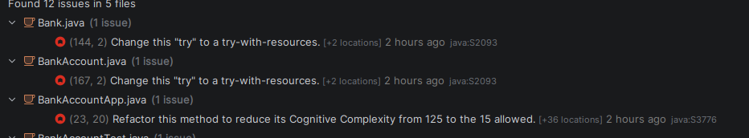
These issues have indeed disappeared. 

**Do SonarLint issues appear more often in the classes with higher WMC / CBO you saw earlier, or not really?**
It doesn't seem to be linked, as the class **Person** has less error thank the classes Bank or BankAccount.
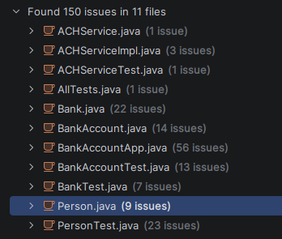

## Exercise 5 (Repo 1): “Java Report for BankApplication” (GitHub Actions - Simple Workflow)
I created this script :
```yaml
name: Java File Scan

on:
  push:
  pull_request:

jobs:
  scan-java:
    runs-on: ubuntu-latest

    steps:
      - name: Checkout repository
        uses: actions/checkout@v4

      - name: Scan Java files and generate report
        run: |
          set -e

          REPORT="java-file-report.txt"

          echo "Java File Report" > "$REPORT"
          echo "================" >> "$REPORT"
          echo "" >> "$REPORT"

          # Find Java files
          JAVA_FILES=$(find . -type f -name "*.java")

          if [ -z "$JAVA_FILES" ]; then
            echo "No .java files found."
            exit 1
          fi

          # Fail if .class files are committed
          CLASS_FILES=$(find . -type f -name "*.class")
          if [ -n "$CLASS_FILES" ]; then
            echo "Compiled .class files found (bad practice):"
            echo "$CLASS_FILES"
            exit 1
          fi

          TOTAL_FILES=0
          TOTAL_LINES=0

          echo "Per-file breakdown:" >> "$REPORT"

          for file in $JAVA_FILES; do
            LINE_COUNT=$(wc -l < "$file")
            echo "$file – $LINE_COUNT" >> "$REPORT"
            TOTAL_FILES=$((TOTAL_FILES + 1))
            TOTAL_LINES=$((TOTAL_LINES + LINE_COUNT))
          done

          echo "" >> "$REPORT"
          echo "Summary:" >> "$REPORT"
          echo "Number of .java files: $TOTAL_FILES" >> "$REPORT"
          echo "Total lines of code: $TOTAL_LINES" >> "$REPORT"

          echo "Report generated:"
          cat "$REPORT"

      - name: Upload Java file report
        uses: actions/upload-artifact@v4
        with:
          name: java-file-report
          path: java-file-report.txt
```
Then checked it :
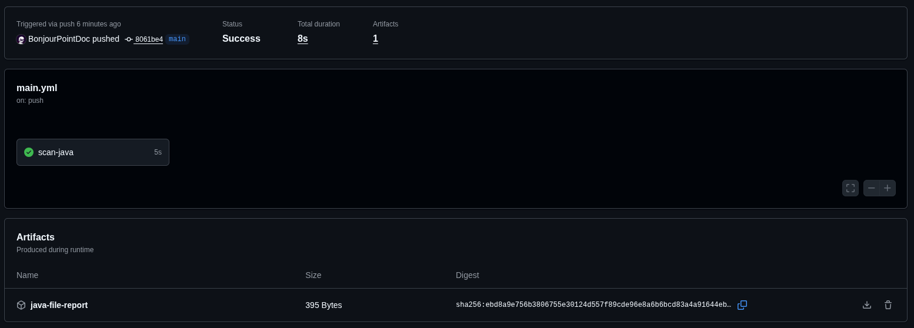

*java-file-report.txt*
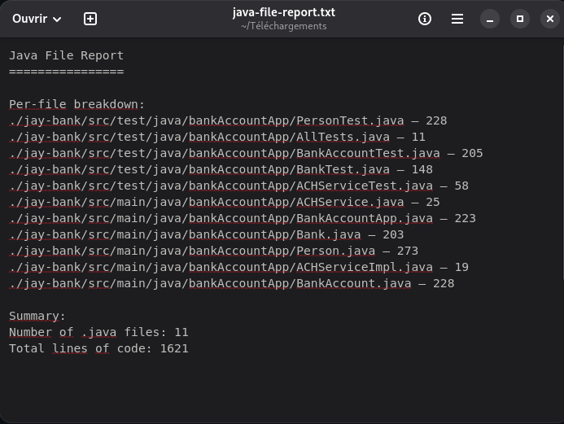
